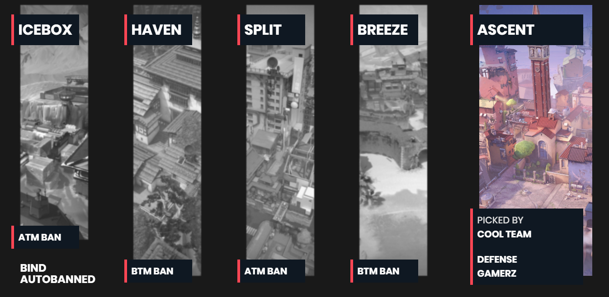
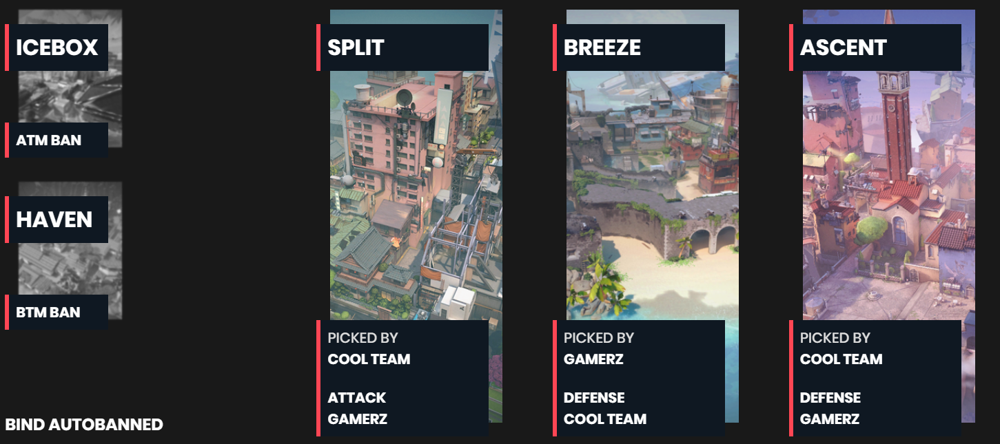
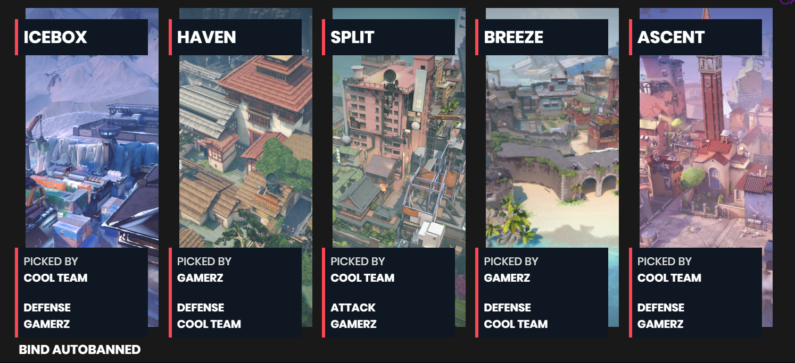

# Valorant Stream Overlay

## For valorant map bans, a timer, score overlays, and more

Valorant stream overlay, uses VALORANT colours by default, but can be customised to whatever you want.
PLEASE NOTE: Some features will not work if the site is not served over HTTPS (twitch/nightbot/websockets),
similarly, you need to have the websocket signalling api found [here](https://github.com/TateB/val-tournament-api) or else OBS features will not work.

## Features

### Timer

Pretty simple timer, for throwing on stream when you are at a break or starting soon.

### Map Bans

Shows map bans in a pretty cool manner, can also show autobans, and does all from a Bo1 to a Bo5.
All it takes is copy pasting your veto log into the settings for it to auto configure itself (in the chance that it doesn't, you can still fix things manually).

### Score overlay

A score overlay for while you are in game, uses team names and scores.
There are 4 options for a score overlay:
`obs/scores`, for an actual in game score overlay.
`obs/scores_characterselect`, for in character select screen, (no actual scores) just puts team names up the top of the screen.
`obs/scores_start`, for a "Team A VS Team B" at a starting screen
`obs/scores_break`, for a multi row score overlay if you're not in game, but in a break or something like that.

### General Settings

You have the ability to choose uppercase or lowercase characters (depending on stream aesthetic), as well as choosing the VOT/LPL colour scheme.
Upcoming is a custom colour chooser, the forms are there but it's not yet implemented so don't try to use it.

### Keep in mind this project is a WIP, and not finished yet.

You will probably encounter bugs. Lol.

### Map Bans Screenshots

Four bans (Bo1):


Two bans (Bo3):


No bans (Bo5):


### OBS Viewports

All OBS viewports can be found on the main settings page by hovering over the red/green dots next to the feature.
They require a WebSocket server to connect to, without the websockets the OBS viewports **WILL NOT RUN**.
By default, the viewport is `http://localhost:3000/obs/feature_name.html#roomID=xxxxxxxx-xxxx-xxxx-xxxx-xxxxxxxxxxxx`, however in production, this is shortened to
`https://localhost/obs/feature_name#roomID=xxxxxxxx-xxxx-xxxx-xxxx-xxxxxxxxxxxx` by using netlify build.

## Technicals

The entire application is build on create-react-app, and in production [available here](https://val.tatebulic.com.au/) runs via netlify, as well as the websocket server hosted on a VM.

This application requires NodeJS to run

How to install:

```
npm install
```

To install all the dependencies.

How to run:

```
npm start
```

This command should run everything smoothly but be sure to check the logs in case there are errors.

How to build:

```
npm build
```

Builds the app for production to the `build` folder.\
It correctly bundles React in production mode and optimizes the build for the best performance.
